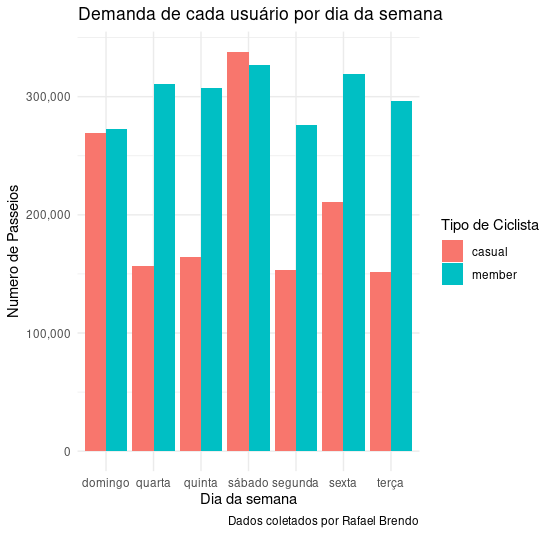

# Estudo de Caso

## Análise do Comportamento de Uso dos Ciclistas Casuais e Membros Anuais da Cyclistic

Autor: Rafael Brendo  
Apresentação em modo Storytelling

## Índice
[Introdução](#introdução)  
[Cenário](#cenário)  
<a href="#partes_interessadas">Partes Interessadas</a> 
[Dados](#dados)  
<a href="#processamento">Processamento e Limpeza</a> 
<a href="#tarefa">Tarefa de Negócios</a> 
<a href="#ferramentas">Ferramentas Utilizadas</a> 
<a href="#visualizacao">Visualização e Análise</a> 
<a href="#conclusao">Conclusão</a> 
<a href="#recomendacao">Recomendações</a> 

## Introdução:
Este estudo de caso foi elaborado pela Google em parceria com a Coursera, como projeto final para obtenção do Certificado Profissional Google Data Analytics. O cenário consiste na analise de dados da Cyclistic para entendimento e, posteriormente, a obtenção de fortes insights.

A Cyclistic é um programa de compartilhamento de bicicletas com mais de 5.800 bicicletas e mais de 600 estações espalhados em Chicago, cidade localizada ao nordeste de Illinois, nos EUA. Neste contexto, o diretor de marketing acredita que o sucesso do futuro da empresa depende da maximização dos números de planos anuais contratados. Portanto, a equipe quer entender como os ciclistas casuais e os membros anuais usam as bicicletas da Cyclistic de forma diferente 

## Cenário:
Eu sou um analista de dados júnior que trabalha na equipe de analistas de marketing da Cyclistic, uma empresa de compartilhamento de bicicletas em Chicago. O diretor de marketing acredita que o sucesso futuro da empresa depende da maximização do número de planos anuais contratados. A partir desses insights, sua equipe criará uma nova estratégia de marketing para converter passageiros casuais em membros anuais. Mas, primeiro, os executivos da Cyclistic devem aprovar suas recomendações que, portanto, devem ser apoiadas com insights de dados  convincentes e visualizações de dados profissionais.

<h2 id="partes_interessadas"> Personagens e Partes Interessadas:</h2>
<ul>
    <li><strong>Cyclistic:</strong> Um programa de compartilhamento de bicicletas que conta com mais de 5.800 bicicletas e 600 estações de compartilhamento. A Cyclistic se diferencia por também oferecer bicicletas reclináveis, triciclos manuais e bicicletas de carga, tornando o compartilhamento de bicicletas mais inclusivo
    <li><strong>Lily Moreno:</strong> Diretora de marketing e sua gerente. Lily é responsável pelo desenvolvimento de campanhas e iniciativas de proomoção do programa de compartilhamento de bicicletas. As campanhas podem incluir e-mail, mídias sociais e outros canais.
    <li><strong>Equipe de análise de marketing da Cyclistic:</strong> Uma equipe de analistas de dados responsáveis por coletar, analisar e relatar dados que ajudam a orientar a estratégia de marketiing da Cyclistic.
    <li><strong>Equipe executiva da Cyclistic:</strong> A equipe executiva notoriamente detalhista decidirá se aprova o programa de marketing recomendado,
</ul>

## Dados
<ul>
    <li><b>Fonte de dados:</b> Os dados foram disponibilizados pela Motivate International Inc. sob esta <a href="https://divvybikes.com/data-license-agreement">licença</a>
    <li><a href="https://divvy-tripdata.s3.amazonaws.com/index.html">Dados históricos</a> de viagens de ciclistas (de 04/2020 - 04/2021) disponíveis em no formato .csv.
    <li>O conjunto de dados possui registros individuais de uso de bicicletas compartilháveis que constam de 13 colunas e 3.826.978 linhas. 
    <li><b>Tamanho dos dados descopactados:</b> 688,7 MB

<h2 id="processamento">Processamento e Limpeza</h2>
<li>Os dados foram baixados para o HD local para manipulação e análise usando o <b>RStudio</b>
<li><a href="https://github.com/Rafabrendo/cyclistic-data-analytics-project/blob/main/cyclistic.R">Documentação e script</a>
<li><b>Quantidade de linhas iniciais:</b> 3.826.978
<li><b>Quantidade de linhas depois da limpeza:</b> 3.553.836 
<li><b>Quantidade de colunas iniciais:</b> 13 colunas
<li><b>Quantidade de colunas Finais:</b> 20 colunas
<li><b>Limpeza:</b> Foram apagados linhas com null e em branco. 
<li><b>Processamento:</b> Foram adicionadas 7 colunas (comeco_passeio, fim_passeio, duracao_passeio, hora, data, dia_semana, km_percorridos)

<h2 id="tarefa">Tarefa de Negócios</h2>
<li>
Analisar os dados da Cyclistic, que é uma empresa de compartilhamento de bicicletas, para poder entender o comportamento dos ciclistas casuais e os membros anuais, como eles utilizam de forma diferente as bicicletas. E a partir desses insights, a equipe vai criar uma nova estrategia de marketing para converter passageiros casuais em membros anuais

<h2 id="ferramentas">Ferramentas Utilizadas</h2>
<li>Foi utilizado a linguagem <b>R</b> e o <b>RStudio</b> em todo o processo de limpeza, processamento e visualização dos dados, porque são ferramentas com grande facilidade de uso e manipulação.

<h2 id="visualizacao">Visualização e analise</h2>
</img>
<h3>Análise:</h3>
<li>59.36% dos ciclistas são membros.
<li>40.64% do ciclistas, são ciclistas casuais.

 

<h3>Análise</h3>
<li>O gráfico demonstra a média de duração do passeio por tipo de ciclista. Nota-se que os ciclistas casuais tem maior média de duração do passeio.

 
 
<h3>Analise</h3>
<li>O gráfico representa a média de duração do passeio, por tipo de ciclista, para cada dia da semana. Demonstrando que os ciclistas casuais tem maior tempo de duração em seus passeios, como já visto anteriormente.

 

<h3>Análise</h3>
<li> O gráfico representa o número de passeios por dia da semana, para cada usuário. 
<li>Os dias mais com maior número de passeios, tanto para membros, como para casuais, são: Sábado e Domingo.
<li>Nota-se que o número de passeio para membros fica acima dos 200 mil, independente do dia da semana. 

 

    
    

<h3>Análise</h3>
<li> Os gráficos representam a frequência de uso dos equipamentos da Cyclistic por dia da semana.
<li>Ao analisar os dois gráficos, nota-se que os usuários membros são mais frequentes.

 

<h3>Análise</h3>
<li>O gráfico representa os horarios do dia e qual a sua requisição por ciclistas membros e ciclistas casuais.
<li>Os horários de maior uso das bicicletas estão entre 10 - 20h.

 

<h3>Análise</h3>
<li>O gráfico representa a quantidade de quilômetros percorridos por dia da semana.
<li>Nota-se que a quantidade de quilômetros percorridos pelos usuários casuais são maiores, tendo seu máximo no sábado, porém, na sexta-feira tem-se um contraste, com usuários membros tendo o seu pico na quantidade de quilômetros percorridos.

 

<h3>Análise</h3>
<li>O gráfico representa a média de quilômetros percorridos por tipo de usuário.
<li>Nota-se que os usuários membros tem maior média, em relação aos usuários não membros.

 
<h1 id="conclusao">Conclusão</h1>

A Cyclistic tem grande potência de crescimento que pode ser via conversão dos ciclistas casuais em membros. Na análise e visualização nota-se que os membros tem maior participação nos lucros das empresas, eles tem maior frequeência e demanda para a utilização dos equipamentos da Cyclistic. Entretanto, ha um contraste quando se compara a média de duração de passeios e a quantidade de quilômetros percorridos, demonstrando que os usuários casuais utilizam as bicicletas para diversos fins, e um deles pode ser para o lazer, como atividades mais longas, com alta duração e elevada quantidade de quilômetros percorridos

<h1 id="recomendacao">Recomendações</h1>

Essas análises fornecem uma compreensão mais profunda dos padrões de uso e comportamentos dos usuários da Cyclistic, o que pode ser útil para aprimorar estratégias de marketing, operações e serviços oferecidos pela empresa.

<li>O marketing pode criar estratégias com promoções e incentivos para encorajar os ciclistas casuais a se tornarem membros, destacando os benefícios exclusivos de se tornar um membro, como descontos em passeios frequentes ou vantagens de fidelidade.
<li>Pode-se aprimorar a experiência do usuário para que a experiência,tanto no aplicativo quanto nos pontos de aluguel de bicicletas, seja conveniente e agradável. Isso pode incluir melhorias na interface do usuário, facilidade de reserva e pagamento, e manutenção de bicicletas de alta qualidade.
<li>Pode se melhorar a qualidade e conforto das bicicletas para futuros membros, porque, como já notado os usuários casuais tem maior quantidade de quilômetros percorridos e maior quantidade de tempo de uso. Isso poderia fazer com que usuários casuais migrassem para usuários membros.
<li>Implemente programas de fidelidade para recompensar os usuários mais frequentes e engajados. Ofereça pontos ou descontos acumulados com base no número de passeios ou quilômetros percorridos, incentivando a utilização contínua do serviço.
<li>Solicite feedback regular dos usuários para identificar áreas de melhoria e entender suas necessidades e preferências. Utilize esses insights para ajustar e aprimorar continuamente os serviços oferecidos pela Cyclistic.